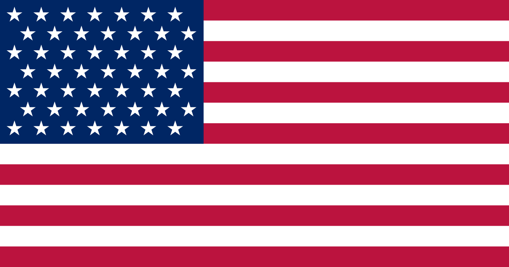
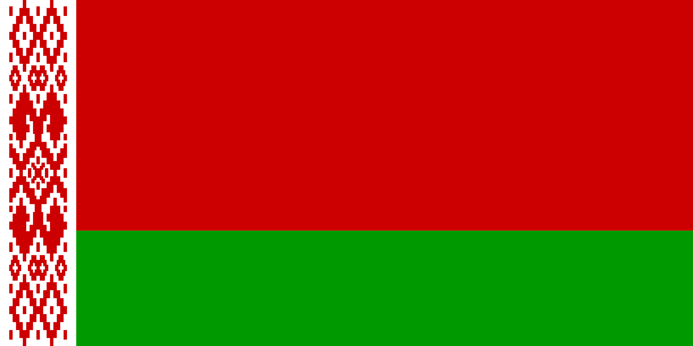

# Dhami Sports
Dhami Sports Management
Website Development
development
   

                

                    

                            

                                    

                                            

                                                

                                                    

                                                            
                                                    

                                                    

                                                         
                                                            <h4 class="panel-title">
                                                            <a  style="color: #232323;padding-left: 20px;line-height: 2;font-family: mm;" role="button" data-toggle="collapse" data-parent="#accordion" href="#collapseOne" aria-expanded="true" aria-controls="collapseOne">
                                                              America
                                                            </a>
                                                    

                                                

                                            </h4>
                                            

                                            

                                              

                                                  <ul>
                                                   <li style="list-style: square;padding: 10px;">Basketball 🏀 </li>
                                                     <li style="list-style: square;padding: 10px;">   Swimming 🏊‍♂ </li>
                                                      <li style="list-style: square;padding: 10px;">  Soccer ⚽</li>
                                               </ul>
                                              

                                            

                                          

                                           

                                          

                                                

                                                    

                                                        

                                                                
                                                        

                                                        

                                                             
                                                                <h4 class="panel-title">
                                                                <a  style="color: #232323;padding-left: 20px;line-height: 2;font-family: mm;" role="button" data-toggle="collapse" data-parent="#accordion" href="#india" aria-expanded="true" aria-controls="india">
                                                                  India
                                                                </a>
                                                        

                                                    

                                                </h4>
                                                

                                                

                                                  

                                                      <ul>
                                                       <li style="list-style: square;padding: 10px;">All Sports  </li>
                                                         <li style="list-style: square;padding: 10px;">   CAS trips ( Critivity Activity and Services ) </li>
                                                        
                                                   </ul>
                                                  

                                                

                                              

                                               

                                              

                                                    

                                                        

                                                            

                                                                    
                                                            

                                                            

                                                                 
                                                                    <h4 class="panel-title">
                                                                    <a  style="color: #232323;padding-left: 20px;line-height: 2;font-family: mm;" role="button" data-toggle="collapse" data-parent="#accordion" href="#canada" aria-expanded="true" aria-controls="canada">
                                                                      Canada
                                                                    </a>
                                                            

                                                        

                                                    </h4>
                                                    

                                                    

                                                      

                                                          <ul>
                                                           <li style="list-style: square;padding: 10px;">Cricket 🏏 </li>
                                                             <li style="list-style: square;padding: 10px;">   Swimming 🏊‍ </li>
                                                              <li style="list-style: square;padding: 10px;">  Hockey 🏑 </li>
                                                       </ul>
                                                      

                                                    

                                                  

                                                   

                                                  

                                                        

                                                            

                                                                

                                                                        
                                                                

                                                                

                                                                     
                                                                        <h4 class="panel-title">
                                                                        <a  style="color: #232323;padding-left: 20px;line-height: 2;font-family: mm;" role="button" data-toggle="collapse" data-parent="#accordion" href="#by" aria-expanded="true" aria-controls="by">
                                                                          Belarus
                                                                        </a>
                                                                

                                                            

                                                        </h4>
                                                        

                                                        

                                                          

                                                              <ul>
                                                               <li style="list-style: square;padding: 10px;">Basketball 🏀 </li>
                                                                 <li style="list-style: square;padding: 10px;">   Swimming 🏊‍♂ </li>
                                                                  <li style="list-style: square;padding: 10px;">  Boxing 🥊</li>
                                                                  <li style="list-style: square;padding: 10px;">  Hockey 🏑</li>
                                                           </ul>
                                                          

                                                        

                                                      

                        
                            

                          

                          

                                

                                  

                                    

                                        

                                            

                                                    
                                            

                                            

                                                 
                                                    <h4 class="panel-title">
                                                    <a  style="color: #232323;padding-left: 20px;line-height: 2;font-family: mm;" role="button" data-toggle="collapse" data-parent="#accordion" href="#bulgaria" aria-expanded="true" aria-controls="bulgaria">
                                                      Bulgaria
                                                    </a>
                                            

                                        

                                    </h4>
                                    

                                    

                                      

                                          <ul>
                                           <li style="list-style: square;padding: 10px;">Basketball 🏀 </li>
                                             <li style="list-style: square;padding: 10px;">   Swimming 🏊‍ </li>
                                              <li style="list-style: square;padding: 10px;">  Leadership Camp 👨🏼‍💼</li>
                                       </ul>
                                      

                                    

                                  

                                   

                                  

                                        

                                            

                                                

                                                        
                                                

                                                

                                                     
                                                        <h4 class="panel-title">
                                                        <a  style="color: #232323;padding-left: 20px;line-height: 2;font-family: mm;" role="button" data-toggle="collapse" data-parent="#accordion" href="#Georgia" aria-expanded="true" aria-controls="Georgia">
                                                          Georgia Tbilisi
                                                        </a>
                                                

                                            

                                        </h4>
                                        

                                        

                                          

                                              <ul>
                                                    <li style="list-style: square;padding: 10px;">Skiing  🎿 </li>
                                                    <li style="list-style: square;padding: 10px;">   Snow Boarding 🏂 </li>
                                                   
                                           </ul>
                                          

                                        

                                      

                                  

 
                                      

                                            

                                                

                                                    

                                                            
                                                    

                                                    

                                                         
                                                            <h4 class="panel-title">
                                                            <a  style="color: #232323;padding-left: 20px;line-height: 2;font-family: mm;" role="button" data-toggle="collapse" data-parent="#accordion" href="#Russia" aria-expanded="true" aria-controls="Russia">
                                                              Russia, Moscow
                                                            </a>
                                                    

                                                

                                            </h4>
                                            

                                            

                                              

                                                  <ul>
                                                   <li style="list-style: square;padding: 10px;">Basketball 🏀 </li>
                                                     <li style="list-style: square;padding: 10px;">   Swimming 🏊‍♂ </li>
                                                      <li style="list-style: square;padding: 10px;">  Soccer ⚽</li>
                                                      <li style="list-style: square;padding: 10px;">   Hockey 🏑 </li>
                                                      <li style="list-style: square;padding: 10px;">  Tennis 🎾 </li>
                                               </ul>
                                              

                                            

                                          

                                           

                                          

                                                

                                                    

                                                        

                                                                
                                                        

                                                        

                                                             
                                                                <h4 class="panel-title">
                                                                <a  style="color: #232323;padding-left: 20px;line-height: 2;font-family: mm;" role="button" data-toggle="collapse" data-parent="#accordion" href="#Kazakhstan" aria-expanded="true" aria-controls="Kazakhstan">
                                                                  Kazakhstan
                                                                </a>
                                                        

                                                    

                                                </h4>
                                                

                                                

                                                  

                                                      <ul>
                                                            <li style="list-style: square;padding: 10px;">Basketball 🏀 </li>
                                                            <li style="list-style: square;padding: 10px;">   Swimming 🏊‍♂ </li>
                                                             <li style="list-style: square;padding: 10px;">  Soccer ⚽</li>
                                                             <li style="list-style: square;padding: 10px;">   Hockey 🏑 </li>
                                                             <li style="list-style: square;padding: 10px;">  Tennis 🎾 </li>
                                                             <b>WINTER</b>
                                                             <li style="list-style: square;padding: 10px;">Skiing  🎿 </li>
                                                             <li style="list-style: square;padding: 10px;">   Snow Boarding 🏂 </li>
                                                   </ul>
                                                  

                                                

                                              

                                              
                                

                              

                            
                                

                                

                                        

                                          

                                            

                                                

                                                    

                                                            
                                                    

                                                    

                                                         
                                                            <h4 class="panel-title">
                                                            <a  style="color: #232323;padding-left: 20px;line-height: 2;font-family: mm;" role="button" data-toggle="collapse" data-parent="#accordion" href="#Turkey" aria-expanded="true" aria-controls="Turkey">
                                                              Turkey
                                                            </a>
                                                    

                                                

                                            </h4>
                                            

                                            

                                              

                                                  <ul>
                                                   <li style="list-style: square;padding: 10px;">Basketball 🏀 </li>
                                                     <li style="list-style: square;padding: 10px;">   Swimming 🏊‍♂ </li>
                                                      <li style="list-style: square;padding: 10px;">  Soccer ⚽</li>
                                                      <li style="list-style: square;padding: 10px;">  Leadership Camp 👨🏼‍💼</li>
                                               </ul>
                                              

                                            

                                          

        
                                           
        
                                          

                                                

                                                    

                                                        

                                                                
                                                        

                                                        

                                                             
                                                                <h4 class="panel-title">
                                                                <a  style="color: #232323;padding-left: 20px;line-height: 2;font-family: mm;" role="button" data-toggle="collapse" data-parent="#accordion" href="#Dubai" aria-expanded="true" aria-controls="Dubai">
                                                                  Dubai
                                                                </a>
                                                        

                                                    

                                                </h4>
                                                

                                                

                                                  

                                                      <ul>
                                                            <li style="list-style: square;padding: 10px;">  Cricket 🏏</li>
                                                       <li style="list-style: square;padding: 10px;">Basketball 🏀 </li>
                                                         <li style="list-style: square;padding: 10px;">   Swimming 🏊‍♂ </li>
                                                          <li style="list-style: square;padding: 10px;">  Soccer ⚽</li>
                                                   </ul>
                                                  

                                                

                                              

                                          
        
         
                                              

                                                    

                                                        

                                                            

                                                                    
                                                            

                                                            

                                                                 
                                                                    <h4 class="panel-title">
                                                                    <a  style="color: #232323;padding-left: 20px;line-height: 2;font-family: mm;" role="button" data-toggle="collapse" data-parent="#accordion" href="#Czech" aria-expanded="true" aria-controls="Czech">
                                                                            Czech Republic
                                                                    </a>
                                                            

                                                        

                                                    </h4>
                                                    

                                                    

                                                      

                                                          <ul>
                                                           <li style="list-style: square;padding: 10px;">Basketball 🏀 </li>
                                                             <li style="list-style: square;padding: 10px;">   Swimming 🏊‍♂ </li>
                                                              <li style="list-style: square;padding: 10px;">  Soccer ⚽</li>
                                                       </ul>
                                                      

                                                    

                                                  

        
        
        
                                                   
        
        
                                                  

                                                        

                                                            

                                                                

                                                                        
                                                                

                                                                

                                                                     
                                                                        <h4 class="panel-title">
                                                                        <a  style="color: #232323;padding-left: 20px;line-height: 2;font-family: mm;" role="button" data-toggle="collapse" data-parent="#accordion" href="#Thailand" aria-expanded="true" aria-controls="Thailand">
                                                                          Thailand
                                                                        </a>
                                                                

                                                            

                                                        </h4>
                                                        

                                                        

                                                          

                                                              <ul>
                                                                 <li style="list-style: square;padding: 10px;">Basketball 🏀 </li>
                                                                 <li style="list-style: square;padding: 10px;">   Swimming 🏊‍ </li>
                                                                  <li style="list-style: square;padding: 10px;">  Soccer ⚽</li>
                                                                  <li style="list-style: square;padding: 10px;">   Tennis 🎾  </li>
                                                                  <li style="list-style: square;padding: 10px;">  Hockey 🏑</li>
                                                                  <li style="list-style: square;padding: 10px;">   Cricket 🏏</li>
                                                           </ul>
                                                          

                                                        

                                                      

                                                      
                                        

                                    

                

 

 

                

                    

        
        
                        

                        <h3>Thailand</h3>
                        

                                <ul style="margin-left: -30px;">
                                        <li style="list-style: none;padding: 5px;">Basketball 🏀 </li>
                                        <li style="list-style:none ;padding: 5px;">   Swimming 🏊‍ </li>
                                         <li style="list-style:none ;padding: 5px;">  Soccer ⚽</li>
                                         <li style="list-style:none ;padding: 5px;">   Tennis 🎾  </li>
                                         <li style="list-style:none ;padding: 5px;">  Hockey 🏑</li>
                                         <li style="list-style:none ;padding: 5px;">   Cricket 🏏</li>
                                    </ul>
                            
                        

                    

        
        
                    

        
        
                        

                        <h3>Belarus</h3>
                        

                                <ul style="margin-left: -30px;">
                                        <li style="list-style:none ;padding: 2px;">Basketball 🏀 </li>
                                        <li style="list-style:none ;padding: 2px;">   Swimming 🏊‍♂ </li>
                                         <li style="list-style:none ;padding: 2px;">  Boxing 🥊</li>
                                         <li style="list-style:none ;padding: 2px;">  Hockey 🏑</li>
                                    </ul>
                            
                        

                    

        
                    

        
        
                        

                        <h3> Russia, Moscow</h3>
                        

                                <ul style="margin-left: -30px;">
                                        <li style="list-style: none;padding: 2px;">Basketball 🏀 </li>
                                        <li style="list-style: none;padding: 2px;">   Swimming 🏊‍♂ </li>
                                         <li style="list-style: none;padding: 2px;">  Soccer ⚽</li>
                                         <li style="list-style: none;padding: 2px;">   Hockey 🏑 </li>
                                         <li style="list-style: none;padding: 2px;">  Tennis 🎾 </li>
                                    </ul>
                            
                        

                    

        
        
                    

        
        
                        

                        <h3> Istanbul, Turkey</h3>
                        

                                <ul style="margin-left: -30px;">
                                        <li style="list-style: none;padding: 2px;">Basketball 🏀 </li>
                                        <li style="list-style: none;padding: 2px;">   Swimming 🏊‍♂ </li>
                                         <li style="list-style: none;padding: 2px;">  Soccer ⚽</li>
                                         <li style="list-style: none;padding: 2px;">  Leadership Camp 👨🏼‍💼</li>
                                    </ul>
                            
                        

                    

        
                    
        
        
                

                     
                

                    

        
        
                        

                        <h3>Almaty, Kazakhstan</h3>
                        

                                <ul style="margin-left: -30px;">
                                        <li style="list-style: none;padding: 2px;">Basketball 🏀 </li>
                                                            <li style="list-style: none;padding: 2px;">   Swimming 🏊‍♂ </li>
                                                             <li style="list-style: none;padding: 2px;">  Soccer ⚽</li>
                                                             <li style="list-style: none;padding: 2px;">   Hockey 🏑 </li>
                                                             <li style="list-style: none;padding: 2px;">  Tennis 🎾 </li>
                                                             <b>WINTER</b>
                                                             <li style="list-style: none;padding: 2px;">Skiing  🎿 </li>
                                                             <li style="list-style: none;padding: 2px;">   Snow Boarding 🏂 </li>
                                    </ul>
                            
                        

                    

        
        
                    

        
        
                        

                        <h3>Dubai, UEA</h3>
                        

                                <ul style="margin-left: -30px;">
                                        <li style="list-style: none;padding: 5px;">  Cricket 🏏</li>
                                        <li style="list-style: none;padding: 5px;">Basketball 🏀 </li>
                                          <li style="list-style: none;padding: 5px;">   Swimming 🏊‍♂ </li>
                                           <li style="list-style: none;padding: 5px;">  Soccer ⚽</li>
                                    </ul>
                            
                        

                    

        
                    

        
        
                        

                        <h3>  Georgia Tbilisi</h3>
                        

                                <ul style="margin-left: -30px;">
                                        <li style="list-style: none;padding: 5px;">Skiing  🎿 </li>
                                                    <li style="list-style: none;padding: 5px;">   Snow Boarding 🏂 </li>
                                    </ul>
                            
                        

                    

        
        
                    

        
        
                        

                        <h3> India</h3>
                        

                                <ul style="margin-left: -30px;">
                                        <li style="list-style: none;padding: 5px;">All Sports  </li>
                                     <li style="list-style: none;padding: 5px;">   CAS trips ( Critivity Activity and Services ) </li>
                                    </ul>
                            
                        

                    

        
                    
        
        
                

        
 

                    

        
        
                        

                        <h3>Canada</h3>
                        

                                <li style="list-style: none;padding: 5px;">Cricket 🏏 </li>
                                <li style="list-style: none;padding: 5px;">   Swimming 🏊‍ </li>
                                 <li style="list-style: none;padding: 5px;">  Hockey 🏑 </li>
                            
                        

                    

        
        
                    

        
        
                        

                        <h3>Bulgaria</h3>
                        

                                <ul style="margin-left: -30px;">
                                        <li style="list-style: none;padding: 5px;">Basketball 🏀 </li>
                                        <li style="list-style: none;padding: 5px;">   Swimming 🏊‍ </li>
                                         <li style="list-style: none;padding: 5px;">  Leadership Camp 👨🏼‍💼</li>
                                    </ul>
                            
                        

                    

        
                    

        
        
                        

                        <h3>Czech Republic</h3>
                        

                                <ul style="margin-left: -30px;">
                                        <li style="list-style: none;padding: 5px;">Basketball 🏀 </li>
                                        <li style="list-style: none;padding: 5px;">   Swimming 🏊‍♂ </li>
                                         <li style="list-style: none;padding: 5px;">  Soccer ⚽</li>
                                    </ul>
                            
                        

                    

        
        
                    

        
        
                        

                        <h3>America</h3>
                        

                                <ul style="margin-left: -30px;">
                                        <li style="list-style: none;padding: 5px;">Basketball 🏀 </li>
                                        <li style="list-style: none;padding: 5px;">   Swimming 🏊‍♂ </li>
                                         <li style="list-style: none;padding: 5px;">  Soccer ⚽</li>
                                    </ul>
                            
                        

                    

        
                    
        
        
                

        
            
